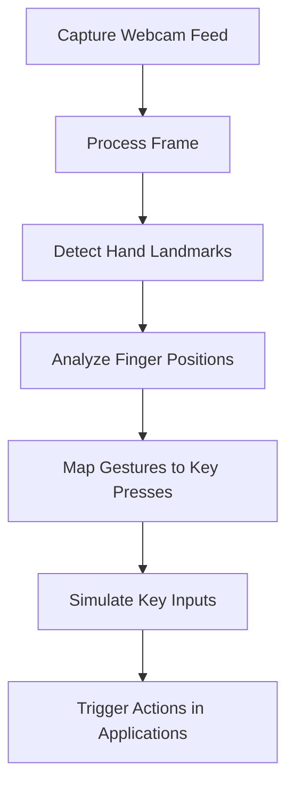

# Hand Gesture-Based Control System

## Overview
This project introduces a hand gesture-based control system that enables users to interact with their devices using real-time hand tracking. By leveraging computer vision techniques, the system interprets hand movements to simulate key presses, making it useful for touchless control in various applications.

## Features
- **Gesture-Based Keypresses**: Map hand gestures to keyboard keys for seamless interaction.
- **Air Typing**: Simulate typing actions without a physical keyboard.
- **Customizable Key Bindings**: Modify gesture mappings for different applications.
- **Touchless Control**: Reduce reliance on physical hardware for accessibility and convenience.

## Potential Use Cases
- **Accessibility**: Assist individuals with mobility impairments by enabling hands-free device interaction.
- **Presentation Control**: Navigate slides and documents using simple hand gestures.
- **Creative Applications**: Use gestures for tool selection and interactions in digital art and design software.
- **Gaming**: Control characters and perform in-game actions using gestures (e.g., moving, jumping, shooting).
- **Virtual Keyboards**: Enable air typing for text input without a physical keyboard.

## Technologies Used
- **OpenCV**: Real-time video processing and hand tracking.
- **MediaPipe**: Gesture recognition and landmark detection.

## How It Works
The system follows these steps to process hand gestures and simulate keypresses:



### Project Structure
```
hand-gesture-control/
├── hand_tracker.py       # Tracks hand movements and detects gestures
├── key_mappings.py       # Stores key mappings for various gestures
├── key_controller.py     # Simulates keypress events based on gestures
├── game.py               # Runs the gesture recognition and key control system
├── requirements.txt      # Lists project dependencies
└── README.md             # Project documentation
```

## Installation
1. Clone the repository:
   ```bash
   git clone https://github.com/your-repo/hand-gesture-control.git
   cd hand-gesture-control
   ```
2. Install dependencies:
   ```bash
   pip install -r requirements.txt
   ```
3. Run the application:
   ```bash
   python main.py
   ```

## Acknowledgments
Special thanks to the open-source community for providing tools like OpenCV, MediaPipe that make real-time gesture control possible.